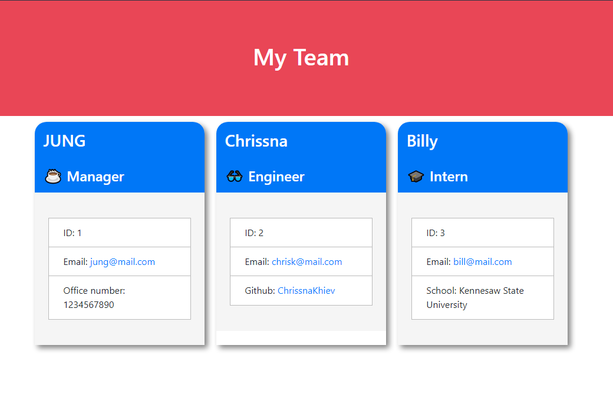

# Khievs-Team-Profile-Generator 
  ## Description
  This is a Node.js command-line application that takes in information from the user to build a software engineering team. The application then generates an HTML webpage that displays a summary of each person on the team.
  ## Table of Contents
  - [Installation](#installation)

  - [Usage](#usage)

  - [Credits](#credits)

  - [License](#license)

  - [Badges](#badges)

  - [Features](#features)

  - [Contribute](#contribute)

  - [Tests](#tests)

  ## Installation
  There is not installation just clone from github then run "node index.js" in the correct terminal location.
  ## Usage
  [Github](https://github.com/ChrissnaKhiev/Khievs-Team-Profile-Generator)

  Input "node index.js" into the appropriate terminal. Follow the prompts once you hit enter until completion of the team.

  
  ## Credits
  None.
  ## License
    [https://github.com/ChrissnaKhiev/Khievs-Team-Profile-Generator/blob/main/LICENSE](https://github.com/ChrissnaKhiev/Khievs-Team-Profile-Generator/blob/main/LICENSE)
  ## Badges
  
  
  ## Features
  Makes a visual webpage of the team created via the application.
  ## Contribute
  None.
  ## Tests
  None.